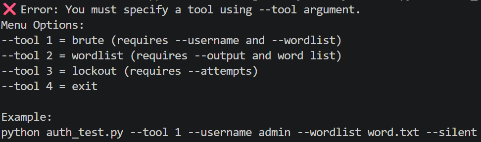
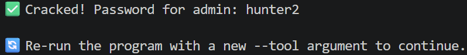
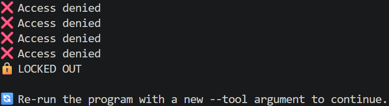
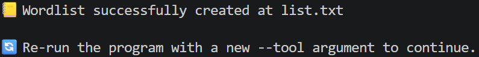

# 🔐 Python Authentication Failure Analysis Tool (CLI Lab)

## 🧠 Overview
This project presents a Python-based CLI tool designed to simulate authentication workflows in a controlled lab environment.  
The focus is on analyzing authentication failures, observing system behavior, and understanding how security monitoring systems detect abnormal login patterns.

---

## 🎯 Objectives
- Simulate controlled authentication attempts for analysis  
- Observe how repeated authentication failures are logged  
- Understand rate-limiting and account lockout behavior  
- Identify patterns used by security monitoring systems to detect anomalies  

---

## ⚙️ Core Functionality

### CLI Argument Handling
The tool uses command-line arguments (`sys.argv`) to allow flexible configuration, including:
- Target username  
- Input dataset file  
- Delay between authentication attempts  

### Dataset Processing
- Reads input data from a structured file  
- Iterates through entries in a controlled sequence  
- Demonstrates file handling and data processing in Python  

### Authentication Workflow Simulation
- Simulates authentication attempts using provided input data  
- Applies configurable delays between attempts to reflect realistic system behavior  
- Supports observation of rate-limiting and lockout responses  

### Logging & Observation
- Records authentication attempts and outcomes  
- Enables analysis of failure patterns over time  
- Helps understand how repeated failures appear in logs and monitoring systems  

---

# 📸 Tool Demonstration

### CLI Menu

### Brute Force Simulation (Success Case)

### Account Lockout Simulation

### Wordlist Generation

---

# 🧠 Security Insight

This tool demonstrates how repeated authentication attempts create detectable patterns in logs.

It highlights:
- How brute-force behavior appears in monitoring systems  
- How rate-limiting and lockout mechanisms respond to abuse  
- How attackers may attempt to evade detection using delays  

This bridges offensive simulation with defensive detection thinking.

---

# 🚀 Quick Run

### Brute Force Simulation
python auth_test.py --tool 1 --username admin --wordlist sample_wordlist.txt --silent

### Generate Wordlist
python auth_test.py --tool 2 --output list.txt pass123 admin123

### Simulate Lockout
python auth_test.py --tool 3 --attempts 1234 1111 2222

---

## 📦 Repository Contents
- `auth_test.py` — CLI-based authentication simulation tool
- `sample_wordlist.txt` — Sample input dataset for testing
- `sample_output.txt` — Sample output based on CLI usage
- `README.md` — Project documentation

---

## 🔍 Key Observations

- Repeated authentication failures generate identifiable patterns in logs  
- Short intervals between attempts may trigger security alerts  
- Systems may enforce rate-limiting or account lockout policies  
- Consistent failure patterns can be detected by monitoring tools (e.g., SIEM systems)  

---

## 🚨 Detection Opportunities

- Monitor for multiple failed authentication attempts within short time intervals  
- Correlate login failures across users or systems  
- Alert on abnormal authentication patterns  
- Track account lockout events as potential security indicators  

---

## 🧰 Skills Demonstrated

- Python CLI development  
- Command-line argument parsing (`sys.argv`)  
- File handling and dataset processing  
- Control flow and iteration logic  
- Authentication workflow analysis  
- Security logging and monitoring awareness  

---

## 🎓 Learning Outcomes

- Understanding how authentication failures are recorded in system logs  
- Recognizing patterns associated with abnormal login behavior  
- Observing how rate-limiting and lockout mechanisms function  
- Building scripts to simulate and analyze system behavior  
- Applying a defensive mindset to authentication monitoring  

---

## ⚠️ Disclaimer
This project was developed for educational purposes in a controlled lab environment.  
It focuses on analyzing authentication behavior and supporting defensive security practices such as monitoring and detection.  

It should only be used on systems where explicit authorization has been granted.